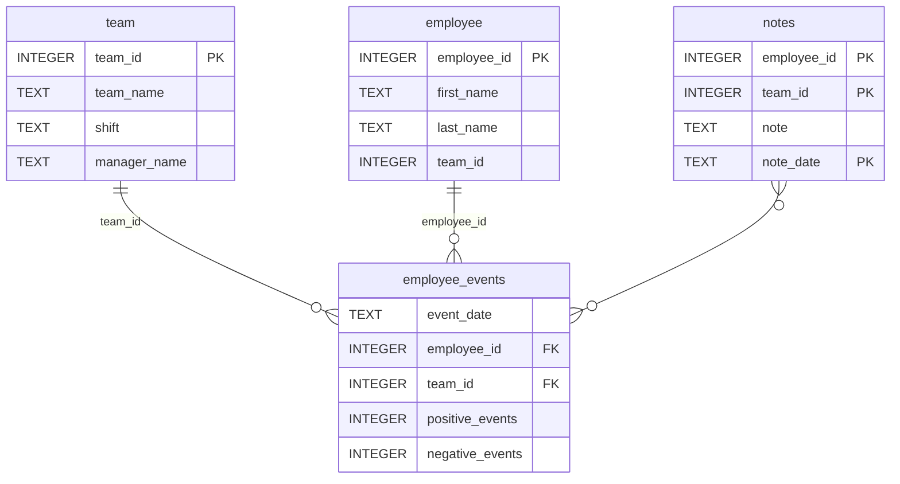

# Software Engineering for Data Scientists 

This repository contains starter code for the **Software Engineering for Data Scientists** final project. Please reference your course materials for documentation on this repository's structure and important files. Happy coding!

### Repository Structure
```
├── README.md
├── assets
│   ├── model.pkl
│   └── report.css
├── env
├── python-package
│   ├── employee_events
│   │   ├── __init__.py
│   │   ├── employee.py
│   │   ├── employee_events.db
│   │   ├── query_base.py
│   │   ├── sql_execution.py
│   │   └── team.py
│   ├── requirements.txt
│   ├── setup.py
├── report
│   ├── base_components
│   │   ├── __init__.py
│   │   ├── base_component.py
│   │   ├── data_table.py
│   │   ├── dropdown.py
│   │   ├── matplotlib_viz.py
│   │   └── radio.py
│   ├── combined_components
│   │   ├── __init__.py
│   │   ├── combined_component.py
│   │   └── form_group.py
│   ├── dashboard.py
│   └── utils.py
├── requirements.txt
├── start
├── tests
    └── test_employee_events.py
```
## Setup & Usage

### Prerequisites
- Python 3.10, 3.11, or 3.12 (avoid brand-new Python releases, as some
  dependencies may not yet ship pre-built wheels for them)
- Git

### 1. Clone the repository
```bash
git clone https://github.com/fahadmreda/dsnd-dashboard-project.git
cd dsnd-dashboard-project
```

### 2. Create and activate a virtual environment
**Windows (PowerShell):**
```powershell
python -m venv venv
venv\Scripts\activate
```

**macOS / Linux:**
```bash
python3 -m venv venv
source venv/bin/activate
```

### 3. Install dependencies
```bash
python -m pip install --upgrade pip
pip install -r requirements.txt
```
This also installs the local `employee_events` Python package in editable
mode (via the `-e ./python-package` line in `requirements.txt`).

### 4. Run the test suite
```bash
pytest tests/
```
All 4 tests (`test_db_exists`, `test_employee_table_exists`,
`test_team_table_exists`, `test_employee_events_table_exists`) should pass.

### 5. Run the dashboard
```bash
cd report
python dashboard.py
```
Then open the URL printed in the terminal (typically
`http://127.0.0.1:5001`) in your browser. Use the Employee/Team radio
toggle and dropdown to explore the dashboard. Press `Ctrl+C` to stop the
server.

### 6. (Optional) Rebuild the Python package distribution
```bash
cd python-package
python setup.py sdist
cd ..
```
This regenerates `python-package/dist/employee_events-0.0.tar.gz`.

### Continuous Integration
This repository includes GitHub Actions workflows
(`.github/workflows/test.yml` and `.github/workflows/lint.yml`) that
automatically run the test suite and flake8 linting on every push and pull
request to `main`.


### employee_events.db


